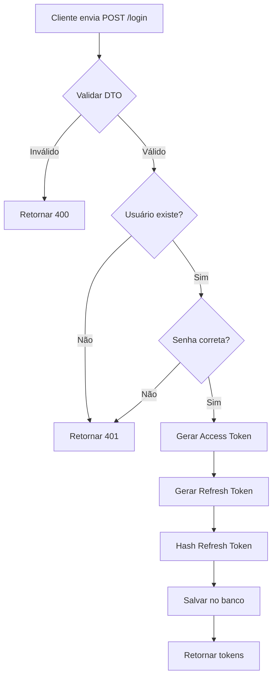

# 🔐 POST /login - Autenticar Usuário

## 📋 Descrição

Endpoint para autenticar um usuário e gerar tokens de acesso (access token e refresh token). Valida as credenciais e retorna tokens JWT.

## 🔗 Endpoint

```
POST /api/login
```

## 🔓 Autenticação

**Não requer autenticação**

## 📥 Request

### Headers

```http
Content-Type: application/json
```

### Body

```json
{
  "email": "usuario@example.com",
  "password": "senha12345678"
}
```

### Campos

| Campo | Tipo | Obrigatório | Descrição |
|-------|------|-------------|-----------|
| email | string | ✅ | Email do usuário |
| password | string | ✅ | Senha do usuário |

## 📤 Response

### Sucesso (200 OK)

```json
{
  "accessToken": "eyJhbGciOiJIUzI1NiIsInR5cCI6IkpXVCJ9.eyJzdWIiOiI1NTBlODQwMC1lMjliLTQxZDQtYTcxNi00NDY2NTU0NDAwMDAiLCJlbWFpbCI6InVzdWFyaW9AZXhhbXBsZS5jb20iLCJpYXQiOjE3MDY3ODg4MDAsImV4cCI6MTcwNjc4OTcwMH0.xxxxx",
  "refreshToken": "eyJhbGciOiJIUzI1NiIsInR5cCI6IkpXVCJ9.eyJzdWIiOiI1NTBlODQwMC1lMjliLTQxZDQtYTcxNi00NDY2NTU0NDAwMDAiLCJ0eXBlIjoicmVmcmVzaCIsImlhdCI6MTcwNjc4ODgwMCwiZXhwIjoxNzA3MzkzNjAwfS55eXl5eQ"
}
```

### Erro - Credenciais Inválidas (401 Unauthorized)

```json
{
  "statusCode": 401,
  "message": "Credenciais inválidas",
  "error": "Unauthorized"
}
```

### Erro - Validação (400 Bad Request)

```json
{
  "statusCode": 400,
  "message": [
    "Email inválido",
    "Senha é obrigatória"
  ],
  "error": "Bad Request"
}
```

### Erro - Servidor (500 Internal Server Error)

```json
{
  "statusCode": 500,
  "message": "Erro ao fazer login",
  "error": "Internal Server Error"
}
```

## 💻 Implementação NestJS

### DTO

```typescript
// src/auth/dto/login.dto.ts
import { IsEmail, IsString } from 'class-validator';
import { ApiProperty } from '@nestjs/swagger';

export class LoginDto {
  @ApiProperty({
    example: 'usuario@example.com',
    description: 'Email do usuário'
  })
  @IsEmail({}, { message: 'Email inválido' })
  email: string;

  @ApiProperty({
    example: 'senha12345678',
    description: 'Senha do usuário'
  })
  @IsString({ message: 'Senha é obrigatória' })
  password: string;
}
```

### Controller

```typescript
// src/auth/auth.controller.ts
import { Controller, Post, Body, HttpCode, HttpStatus } from '@nestjs/common';
import { ApiTags, ApiOperation, ApiResponse } from '@nestjs/swagger';
import { AuthService } from './auth.service';
import { LoginDto } from './dto/login.dto';

@ApiTags('Authentication')
@Controller('api')
export class AuthController {
  constructor(private readonly authService: AuthService) {}

  @Post('login')
  @HttpCode(HttpStatus.OK)
  @ApiOperation({ summary: 'Autenticar usuário' })
  @ApiResponse({ status: 200, description: 'Login realizado com sucesso' })
  @ApiResponse({ status: 401, description: 'Credenciais inválidas' })
  @ApiResponse({ status: 400, description: 'Dados inválidos' })
  async login(@Body() loginDto: LoginDto) {
    return this.authService.login(loginDto);
  }
}
```

### Service

```typescript
// src/auth/auth.service.ts
import { Injectable, UnauthorizedException } from '@nestjs/common';
import { JwtService } from '@nestjs/jwt';
import { InjectRepository } from '@nestjs/typeorm';
import { Repository } from 'typeorm';
import * as bcrypt from 'bcrypt';
import { User } from '../users/entities/user.entity';
import { RefreshToken } from '../auth/entities/refresh-token.entity';
import { LoginDto } from './dto/login.dto';

@Injectable()
export class AuthService {
  constructor(
    @InjectRepository(User)
    private usersRepository: Repository<User>,
    @InjectRepository(RefreshToken)
    private refreshTokensRepository: Repository<RefreshToken>,
    private jwtService: JwtService,
  ) {}

  async login(loginDto: LoginDto) {
    const { email, password } = loginDto;

    // Busca usuário pelo email
    const user = await this.usersRepository.findOne({
      where: { email }
    });

    if (!user) {
      throw new UnauthorizedException('Credenciais inválidas');
    }

    // Valida senha
    const isPasswordValid = await bcrypt.compare(password, user.password);

    if (!isPasswordValid) {
      throw new UnauthorizedException('Credenciais inválidas');
    }

    // Gera tokens
    const tokens = await this.generateTokens(user);

    return tokens;
  }

  async generateTokens(user: User) {
    const payload = {
      sub: user.id,
      email: user.email
    };

    // Access Token (15 minutos)
    const accessToken = this.jwtService.sign(payload, {
      expiresIn: '15m'
    });

    // Refresh Token (7 dias)
    const refreshToken = this.jwtService.sign(
      { ...payload, type: 'refresh' },
      { expiresIn: '7d' }
    );

    // Salva refresh token no banco (com hash)
    const hashedRefreshToken = await bcrypt.hash(refreshToken, 10);
    
    const refreshTokenEntity = this.refreshTokensRepository.create({
      tokenHash: hashedRefreshToken,
      userId: user.id,
      expiresAt: new Date(Date.now() + 7 * 24 * 60 * 60 * 1000), // 7 dias
      isRevoked: false
    });

    await this.refreshTokensRepository.save(refreshTokenEntity);

    return {
      accessToken,
      refreshToken
    };
  }
}
```

### Entity - RefreshToken

```typescript
// src/auth/entities/refresh-token.entity.ts
import {
  Entity,
  Column,
  PrimaryGeneratedColumn,
  CreateDateColumn,
  ManyToOne,
  JoinColumn,
} from 'typeorm';
import { User } from '../../users/entities/user.entity';

@Entity('refresh_tokens')
export class RefreshToken {
  @PrimaryGeneratedColumn('uuid')
  id: string;

  @Column({ name: 'token_hash' })
  tokenHash: string;

  @Column({ name: 'user_id' })
  userId: string;

  @ManyToOne(() => User, { onDelete: 'CASCADE' })
  @JoinColumn({ name: 'user_id' })
  user: User;

  @Column({ name: 'expires_at' })
  expiresAt: Date;

  @Column({ name: 'is_revoked', default: false })
  isRevoked: boolean;

  @CreateDateColumn({ name: 'created_at' })
  createdAt: Date;
}
```

### JWT Module Configuration

```typescript
// src/auth/auth.module.ts
import { Module } from '@nestjs/common';
import { JwtModule } from '@nestjs/jwt';
import { TypeOrmModule } from '@nestjs/typeorm';
import { ConfigModule, ConfigService } from '@nestjs/config';
import { AuthController } from './auth.controller';
import { AuthService } from './auth.service';
import { User } from '../users/entities/user.entity';
import { RefreshToken } from './entities/refresh-token.entity';

@Module({
  imports: [
    TypeOrmModule.forFeature([User, RefreshToken]),
    JwtModule.registerAsync({
      imports: [ConfigModule],
      useFactory: async (configService: ConfigService) => ({
        secret: configService.get<string>('JWT_SECRET'),
        signOptions: {
          expiresIn: '15m',
        },
      }),
      inject: [ConfigService],
    }),
  ],
  controllers: [AuthController],
  providers: [AuthService],
  exports: [AuthService],
})
export class AuthModule {}
```

## 🧪 Exemplos de Teste

### cURL

```bash
curl -X POST http://localhost:3000/api/login \
  -H "Content-Type: application/json" \
  -d '{
    "email": "usuario@example.com",
    "password": "senha12345678"
  }'
```

### JavaScript (Fetch)

```javascript
const response = await fetch('http://localhost:3000/api/login', {
  method: 'POST',
  headers: {
    'Content-Type': 'application/json'
  },
  body: JSON.stringify({
    email: 'usuario@example.com',
    password: 'senha12345678'
  })
});

const { accessToken, refreshToken } = await response.json();

// Salvar tokens no sessionStorage
sessionStorage.setItem('access_token', accessToken);
sessionStorage.setItem('refresh_token', refreshToken);
```

### Postman

1. **Method:** POST
2. **URL:** `http://localhost:3000/api/login`
3. **Headers:**
   - `Content-Type: application/json`
4. **Body (raw JSON):**
```json
{
  "email": "usuario@example.com",
  "password": "senha12345678"
}
```

## 🔑 Estrutura dos Tokens

### Access Token Payload

```json
{
  "sub": "550e8400-e29b-41d4-a716-446655440000",
  "email": "usuario@example.com",
  "iat": 1706788800,
  "exp": 1706789700
}
```

### Refresh Token Payload

```json
{
  "sub": "550e8400-e29b-41d4-a716-446655440000",
  "email": "usuario@example.com",
  "type": "refresh",
  "iat": 1706788800,
  "exp": 1707393600
}
```

## ✅ Validações Necessárias

### Backend
- [x] Email deve ser válido
- [x] Senha deve estar presente
- [x] Usuário deve existir no banco
- [x] Senha deve ser comparada com bcrypt
- [x] Access token deve expirar em 15 minutos
- [x] Refresh token deve expirar em 7 dias
- [x] Refresh token deve ser hasheado antes de salvar

### Frontend (já implementado)
- ✅ Validação de email com Zod
- ✅ Validação de senha obrigatória
- ✅ Armazenamento de tokens no sessionStorage
- ✅ Redirecionamento após login
- ✅ Feedback visual de erros

## 🔒 Segurança

1. **Não retorne a senha:** Nunca retorne a senha do usuário
2. **Mensagens genéricas:** Use "Credenciais inválidas" para email e senha errados (não especifique qual está errado)
3. **Rate Limiting:** Limite tentativas de login (ex: 5 tentativas por 15 minutos)
4. **Hash do Refresh Token:** Salve apenas o hash do refresh token no banco
5. **HTTPS:** Use sempre HTTPS em produção
6. **Tempo de expiração:** Access token curto (15min), Refresh token longo (7 dias)

## 📊 Status Codes

| Status | Descrição |
|--------|-----------|
| 200 | OK - Login realizado com sucesso |
| 400 | Bad Request - Dados inválidos |
| 401 | Unauthorized - Credenciais inválidas |
| 500 | Internal Server Error - Erro no servidor |

## 🔄 Fluxo de Execução



## 🐛 Troubleshooting

### Erro: Token expira imediatamente

**Causa:** Configuração incorreta do tempo de expiração.

**Solução:** Verifique se está usando `15m` para minutos, não `15` sozinho.

### Erro: Senha sempre inválida

**Causa:** A senha no banco não está hasheada ou o bcrypt.compare está incorreto.

**Solução:** Verifique se a senha foi hasheada no registro e se está usando bcrypt.compare corretamente.

### Erro: Refresh token não está sendo salvo

**Causa:** Entity ou relação não está configurada corretamente.

**Solução:** Verifique se a entity RefreshToken está registrada no TypeORM.

---

**Anterior:** [← Register API](./register_API.md) | **Próximo:** [Logout API →](./logout_API.md)
