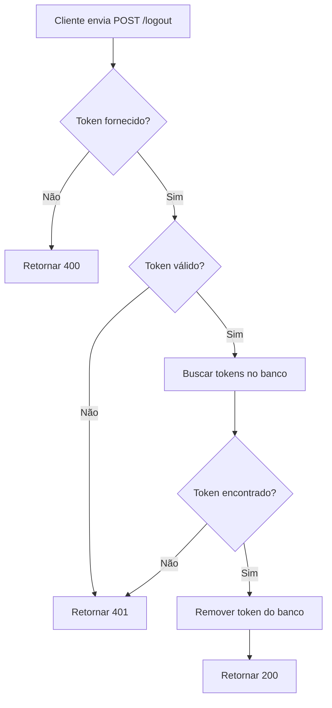

# 🚪 POST /logout - Deslogar Usuário

## 📋 Descrição

Endpoint para deslogar o usuário do sistema. Remove o refresh token do banco de dados, invalidando futuras renovações de access token.

## 🔗 Endpoint

```
POST /api/logout
```

## 🔓 Autenticação

**Não requer autenticação** (mas requer o refresh token no body)

## 📥 Request

### Headers

```http
Content-Type: application/json
```

### Body

```json
{
  "refreshToken": "eyJhbGciOiJIUzI1NiIsInR5cCI6IkpXVCJ9.eyJzdWIiOiI1NTBlODQwMC1lMjliLTQxZDQtYTcxNi00NDY2NTU0NDAwMDAiLCJ0eXBlIjoicmVmcmVzaCIsImlhdCI6MTcwNjc4ODgwMCwiZXhwIjoxNzA3MzkzNjAwfS55eXl5eQ"
}
```

### Campos

| Campo | Tipo | Obrigatório | Descrição |
|-------|------|-------------|-----------|
| refreshToken | string | ✅ | Refresh token JWT |

## 📤 Response

### Sucesso (200 OK)

```json
{
  "message": "Logout realizado com sucesso"
}
```

### Erro - Token não fornecido (400 Bad Request)

```json
{
  "statusCode": 400,
  "message": "Refresh token é obrigatório",
  "error": "Bad Request"
}
```

### Erro - Token inválido (401 Unauthorized)

```json
{
  "statusCode": 401,
  "message": "Refresh token inválido ou expirado",
  "error": "Unauthorized"
}
```

### Erro - Servidor (500 Internal Server Error)

```json
{
  "statusCode": 500,
  "message": "Erro ao fazer logout",
  "error": "Internal Server Error"
}
```

## 💻 Implementação NestJS

### DTO

```typescript
// src/auth/dto/logout.dto.ts
import { IsString, IsNotEmpty } from 'class-validator';
import { ApiProperty } from '@nestjs/swagger';

export class LogoutDto {
  @ApiProperty({
    example: 'eyJhbGciOiJIUzI1NiIsInR5cCI6IkpXVCJ9...',
    description: 'Refresh token JWT'
  })
  @IsString()
  @IsNotEmpty({ message: 'Refresh token é obrigatório' })
  refreshToken: string;
}
```

### Controller

```typescript
// src/auth/auth.controller.ts
import { Controller, Post, Body, HttpCode, HttpStatus } from '@nestjs/common';
import { ApiTags, ApiOperation, ApiResponse } from '@nestjs/swagger';
import { AuthService } from './auth.service';
import { LogoutDto } from './dto/logout.dto';

@ApiTags('Authentication')
@Controller('api')
export class AuthController {
  constructor(private readonly authService: AuthService) {}

  @Post('logout')
  @HttpCode(HttpStatus.OK)
  @ApiOperation({ summary: 'Deslogar usuário' })
  @ApiResponse({ status: 200, description: 'Logout realizado com sucesso' })
  @ApiResponse({ status: 400, description: 'Token não fornecido' })
  @ApiResponse({ status: 401, description: 'Token inválido' })
  async logout(@Body() logoutDto: LogoutDto) {
    return this.authService.logout(logoutDto);
  }
}
```

### Service

```typescript
// src/auth/auth.service.ts
import { 
  Injectable, 
  UnauthorizedException,
  BadRequestException 
} from '@nestjs/common';
import { JwtService } from '@nestjs/jwt';
import { InjectRepository } from '@nestjs/typeorm';
import { Repository } from 'typeorm';
import * as bcrypt from 'bcrypt';
import { RefreshToken } from './entities/refresh-token.entity';
import { LogoutDto } from './dto/logout.dto';

@Injectable()
export class AuthService {
  constructor(
    @InjectRepository(RefreshToken)
    private refreshTokensRepository: Repository<RefreshToken>,
    private jwtService: JwtService,
  ) {}

  async logout(logoutDto: LogoutDto) {
    const { refreshToken } = logoutDto;

    if (!refreshToken) {
      throw new BadRequestException('Refresh token é obrigatório');
    }

    try {
      // Verifica se o token é válido
      const payload = this.jwtService.verify(refreshToken);

      // Busca todos os refresh tokens do usuário no banco
      const tokens = await this.refreshTokensRepository.find({
        where: {
          userId: payload.sub,
          isRevoked: false
        }
      });

      // Procura o token que corresponde ao hash
      let tokenFound = false;
      for (const tokenEntity of tokens) {
        const isMatch = await bcrypt.compare(refreshToken, tokenEntity.tokenHash);
        
        if (isMatch) {
          tokenFound = true;
          // Remove o token do banco
          await this.refreshTokensRepository.delete(tokenEntity.id);
          break;
        }
      }

      if (!tokenFound) {
        throw new UnauthorizedException('Refresh token não encontrado');
      }

      return {
        message: 'Logout realizado com sucesso'
      };
    } catch (error) {
      if (error.name === 'JsonWebTokenError' || error.name === 'TokenExpiredError') {
        throw new UnauthorizedException('Refresh token inválido ou expirado');
      }
      throw error;
    }
  }
}
```

## 🧪 Exemplos de Teste

### cURL

```bash
curl -X POST http://localhost:3000/api/logout \
  -H "Content-Type: application/json" \
  -d '{
    "refreshToken": "eyJhbGciOiJIUzI1NiIsInR5cCI6IkpXVCJ9..."
  }'
```

### JavaScript (Fetch)

```javascript
const refreshToken = sessionStorage.getItem('refresh_token');

const response = await fetch('http://localhost:3000/api/logout', {
  method: 'POST',
  headers: {
    'Content-Type': 'application/json'
  },
  body: JSON.stringify({
    refreshToken
  })
});

if (response.ok) {
  // Limpar tokens do sessionStorage
  sessionStorage.removeItem('access_token');
  sessionStorage.removeItem('refresh_token');
  
  // Redirecionar para login
  window.location.href = '/login';
}
```

### Postman

1. **Method:** POST
2. **URL:** `http://localhost:3000/api/logout`
3. **Headers:**
   - `Content-Type: application/json`
4. **Body (raw JSON):**
```json
{
  "refreshToken": "eyJhbGciOiJIUzI1NiIsInR5cCI6IkpXVCJ9..."
}
```

## ✅ Validações Necessárias

### Backend
- [x] Refresh token deve estar presente
- [x] Refresh token deve ser válido (JWT válido)
- [x] Token deve existir no banco de dados
- [x] Token não deve estar expirado
- [x] Token não deve estar revogado
- [x] Remover token do banco após logout

### Frontend (já implementado)
- ✅ Envia refresh token do sessionStorage
- ✅ Limpa tokens após logout
- ✅ Redireciona para login
- ✅ Feedback visual
- ✅ Trata erros

## 🔒 Segurança

1. **Remoção do Token:** Sempre remova o refresh token do banco
2. **Validação JWT:** Verifique se o token é válido antes de remover
3. **Hash Comparison:** Compare o token com o hash armazenado
4. **Não retorne informações sensíveis:** Apenas confirme o logout
5. **Cleanup:** Considere remover tokens expirados periodicamente

## 📊 Status Codes

| Status | Descrição |
|--------|-----------|
| 200 | OK - Logout realizado com sucesso |
| 400 | Bad Request - Token não fornecido |
| 401 | Unauthorized - Token inválido ou expirado |
| 500 | Internal Server Error - Erro no servidor |

## 🔄 Fluxo de Execução



## 🧹 Limpeza de Tokens Expirados (Recomendado)

Crie um serviço agendado para limpar tokens expirados:

```typescript
// src/auth/auth-cleanup.service.ts
import { Injectable } from '@nestjs/common';
import { Cron, CronExpression } from '@nestjs/schedule';
import { InjectRepository } from '@nestjs/typeorm';
import { Repository, LessThan } from 'typeorm';
import { RefreshToken } from './entities/refresh-token.entity';

@Injectable()
export class AuthCleanupService {
  constructor(
    @InjectRepository(RefreshToken)
    private refreshTokensRepository: Repository<RefreshToken>,
  ) {}

  // Executa todo dia à meia-noite
  @Cron(CronExpression.EVERY_DAY_AT_MIDNIGHT)
  async cleanupExpiredTokens() {
    const now = new Date();
    
    const result = await this.refreshTokensRepository.delete({
      expiresAt: LessThan(now)
    });

    console.log(`Removed ${result.affected} expired refresh tokens`);
  }
}
```

Configure o módulo de schedule:

```typescript
// src/auth/auth.module.ts
import { Module } from '@nestjs/common';
import { ScheduleModule } from '@nestjs/schedule';
import { AuthCleanupService } from './auth-cleanup.service';

@Module({
  imports: [
    ScheduleModule.forRoot(),
    // ... outros imports
  ],
  providers: [AuthService, AuthCleanupService],
})
export class AuthModule {}
```

## 🐛 Troubleshooting

### Erro: Token não encontrado mas deveria existir

**Causa:** O hash do token pode não estar correspondendo.

**Solução:** Verifique se está usando bcrypt.compare corretamente e se o token foi hasheado ao ser salvo.

### Erro: Logout não invalida o token

**Causa:** O token não está sendo removido do banco ou o front-end não está limpando o sessionStorage.

**Solução:** Verifique se o DELETE está funcionando e se o front-end está limpando os tokens localmente.

### Warning: Muitos tokens expirados no banco

**Causa:** Não há limpeza automática de tokens expirados.

**Solução:** Implemente o serviço de limpeza agendada mostrado acima.

---

**Anterior:** [← Login API](./login_API.md) | **Próximo:** [Refresh API →](./refresh_API.md)
