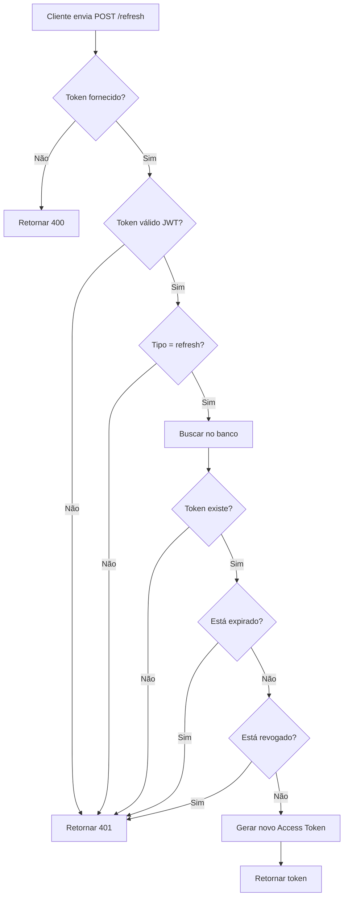

# 🔄 POST /refresh - Renovar Access Token

## 📋 Descrição

Endpoint para renovar o access token usando um refresh token válido. Permite que o usuário continue autenticado sem precisar fazer login novamente.

## 🔗 Endpoint

```
POST /api/refresh
```

## 🔓 Autenticação

**Não requer autenticação no header** (mas requer refresh token no body)

## 📥 Request

### Headers

```http
Content-Type: application/json
```

### Body

```json
{
  "refreshToken": "eyJhbGciOiJIUzI1NiIsInR5cCI6IkpXVCJ9.eyJzdWIiOiI1NTBlODQwMC1lMjliLTQxZDQtYTcxNi00NDY2NTU0NDAwMDAiLCJ0eXBlIjoicmVmcmVzaCIsImlhdCI6MTcwNjc4ODgwMCwiZXhwIjoxNzA3MzkzNjAwfS55eXl5eQ"
}
```

### Campos

| Campo | Tipo | Obrigatório | Descrição |
|-------|------|-------------|-----------|
| refreshToken | string | ✅ | Refresh token JWT válido |

## 📤 Response

### Sucesso (200 OK)

```json
{
  "accessToken": "eyJhbGciOiJIUzI1NiIsInR5cCI6IkpXVCJ9.eyJzdWIiOiI1NTBlODQwMC1lMjliLTQxZDQtYTcxNi00NDY2NTU0NDAwMDAiLCJlbWFpbCI6InVzdWFyaW9AZXhhbXBsZS5jb20iLCJpYXQiOjE3MDY3ODk3MDAsImV4cCI6MTcwNjc5MDYwMH0.xxxxx"
}
```

### Erro - Token não fornecido (400 Bad Request)

```json
{
  "statusCode": 400,
  "message": "Refresh token é obrigatório",
  "error": "Bad Request"
}
```

### Erro - Token inválido/expirado (401 Unauthorized)

```json
{
  "statusCode": 401,
  "message": "Refresh token inválido ou expirado",
  "error": "Unauthorized"
}
```

### Erro - Token revogado (401 Unauthorized)

```json
{
  "statusCode": 401,
  "message": "Refresh token foi revogado",
  "error": "Unauthorized"
}
```

### Erro - Servidor (500 Internal Server Error)

```json
{
  "statusCode": 500,
  "message": "Erro ao renovar token",
  "error": "Internal Server Error"
}
```

## 💻 Implementação NestJS

### DTO

```typescript
// src/auth/dto/refresh-token.dto.ts
import { IsString, IsNotEmpty } from 'class-validator';
import { ApiProperty } from '@nestjs/swagger';

export class RefreshTokenDto {
  @ApiProperty({
    example: 'eyJhbGciOiJIUzI1NiIsInR5cCI6IkpXVCJ9...',
    description: 'Refresh token JWT'
  })
  @IsString()
  @IsNotEmpty({ message: 'Refresh token é obrigatório' })
  refreshToken: string;
}
```

### Controller

```typescript
// src/auth/auth.controller.ts
import { Controller, Post, Body, HttpCode, HttpStatus } from '@nestjs/common';
import { ApiTags, ApiOperation, ApiResponse } from '@nestjs/swagger';
import { AuthService } from './auth.service';
import { RefreshTokenDto } from './dto/refresh-token.dto';

@ApiTags('Authentication')
@Controller('api')
export class AuthController {
  constructor(private readonly authService: AuthService) {}

  @Post('refresh')
  @HttpCode(HttpStatus.OK)
  @ApiOperation({ summary: 'Renovar access token' })
  @ApiResponse({ status: 200, description: 'Token renovado com sucesso' })
  @ApiResponse({ status: 400, description: 'Token não fornecido' })
  @ApiResponse({ status: 401, description: 'Token inválido ou expirado' })
  async refresh(@Body() refreshTokenDto: RefreshTokenDto) {
    return this.authService.refreshToken(refreshTokenDto);
  }
}
```

### Service

```typescript
// src/auth/auth.service.ts
import { 
  Injectable, 
  UnauthorizedException,
  BadRequestException 
} from '@nestjs/common';
import { JwtService } from '@nestjs/jwt';
import { InjectRepository } from '@nestjs/typeorm';
import { Repository } from 'typeorm';
import * as bcrypt from 'bcrypt';
import { RefreshToken } from './entities/refresh-token.entity';
import { User } from '../users/entities/user.entity';
import { RefreshTokenDto } from './dto/refresh-token.dto';

@Injectable()
export class AuthService {
  constructor(
    @InjectRepository(RefreshToken)
    private refreshTokensRepository: Repository<RefreshToken>,
    @InjectRepository(User)
    private usersRepository: Repository<User>,
    private jwtService: JwtService,
  ) {}

  async refreshToken(refreshTokenDto: RefreshTokenDto) {
    const { refreshToken } = refreshTokenDto;

    if (!refreshToken) {
      throw new BadRequestException('Refresh token é obrigatório');
    }

    try {
      // Verifica se o token é válido
      const payload = this.jwtService.verify(refreshToken);

      // Verifica se é um refresh token
      if (payload.type !== 'refresh') {
        throw new UnauthorizedException('Token inválido');
      }

      // Busca o usuário
      const user = await this.usersRepository.findOne({
        where: { id: payload.sub }
      });

      if (!user) {
        throw new UnauthorizedException('Usuário não encontrado');
      }

      // Busca todos os refresh tokens ativos do usuário
      const tokens = await this.refreshTokensRepository.find({
        where: {
          userId: user.id,
          isRevoked: false
        }
      });

      // Verifica se o token existe no banco
      let tokenFound = false;
      for (const tokenEntity of tokens) {
        const isMatch = await bcrypt.compare(refreshToken, tokenEntity.tokenHash);
        
        if (isMatch) {
          // Verifica se não expirou
          if (new Date() > tokenEntity.expiresAt) {
            throw new UnauthorizedException('Refresh token expirado');
          }

          tokenFound = true;
          break;
        }
      }

      if (!tokenFound) {
        throw new UnauthorizedException('Refresh token não encontrado ou foi revogado');
      }

      // Gera novo access token
      const newAccessToken = this.jwtService.sign({
        sub: user.id,
        email: user.email
      }, {
        expiresIn: '15m'
      });

      return {
        accessToken: newAccessToken
      };
    } catch (error) {
      if (error.name === 'JsonWebTokenError') {
        throw new UnauthorizedException('Refresh token inválido');
      }
      if (error.name === 'TokenExpiredError') {
        throw new UnauthorizedException('Refresh token expirado');
      }
      throw error;
    }
  }
}
```

## 🧪 Exemplos de Teste

### cURL

```bash
curl -X POST http://localhost:3000/api/refresh \
  -H "Content-Type: application/json" \
  -d '{
    "refreshToken": "eyJhbGciOiJIUzI1NiIsInR5cCI6IkpXVCJ9..."
  }'
```

### JavaScript (Fetch)

```javascript
const refreshToken = sessionStorage.getItem('refresh_token');

const response = await fetch('http://localhost:3000/api/refresh', {
  method: 'POST',
  headers: {
    'Content-Type': 'application/json'
  },
  body: JSON.stringify({
    refreshToken
  })
});

if (response.ok) {
  const { accessToken } = await response.json();
  
  // Atualizar access token no sessionStorage
  sessionStorage.setItem('access_token', accessToken);
} else {
  // Token expirado ou inválido - redirecionar para login
  sessionStorage.clear();
  window.location.href = '/login';
}
```

### Postman

1. **Method:** POST
2. **URL:** `http://localhost:3000/api/refresh`
3. **Headers:**
   - `Content-Type: application/json`
4. **Body (raw JSON):**
```json
{
  "refreshToken": "eyJhbGciOiJIUzI1NiIsInR5cCI6IkpXVCJ9..."
}
```

## ✅ Validações Necessárias

### Backend
- [x] Refresh token deve estar presente
- [x] Token deve ser um JWT válido
- [x] Token deve ser do tipo "refresh"
- [x] Token deve existir no banco de dados
- [x] Token não deve estar expirado
- [x] Token não deve estar revogado
- [x] Usuário deve existir no banco
- [x] Gerar novo access token válido por 15 minutos

### Frontend (já implementado)
- ✅ Interceptor detecta erro 401
- ✅ Tenta renovar token automaticamente
- ✅ Atualiza access token no sessionStorage
- ✅ Reenvia requisição original com novo token
- ✅ Se falhar, desloga usuário

## 🔒 Segurança

1. **Não gere novo refresh token:** Apenas retorne novo access token
2. **Validação rigorosa:** Verifique se o refresh token existe e não está revogado
3. **Tipo de token:** Certifique-se que é um refresh token (campo `type: 'refresh'`)
4. **Expiração:** Verifique se o token não expirou no banco
5. **One-time use (opcional):** Considere invalidar o refresh token usado e gerar um novo par

## 📊 Status Codes

| Status | Descrição |
|--------|-----------|
| 200 | OK - Token renovado com sucesso |
| 400 | Bad Request - Token não fornecido |
| 401 | Unauthorized - Token inválido, expirado ou revogado |
| 500 | Internal Server Error - Erro no servidor |

## 🔄 Fluxo de Execução



## 🔄 Refresh Token Rotation (Avançado - Opcional)

Para maior segurança, você pode implementar rotação de refresh tokens:

```typescript
async refreshTokenWithRotation(refreshTokenDto: RefreshTokenDto) {
  // ... validações anteriores ...

  // Revoga o refresh token antigo
  await this.refreshTokensRepository.update(
    { id: tokenEntity.id },
    { isRevoked: true }
  );

  // Gera novo par de tokens
  const newAccessToken = this.jwtService.sign({
    sub: user.id,
    email: user.email
  }, { expiresIn: '15m' });

  const newRefreshToken = this.jwtService.sign({
    sub: user.id,
    email: user.email,
    type: 'refresh'
  }, { expiresIn: '7d' });

  // Salva novo refresh token
  const hashedRefreshToken = await bcrypt.hash(newRefreshToken, 10);
  await this.refreshTokensRepository.save({
    tokenHash: hashedRefreshToken,
    userId: user.id,
    expiresAt: new Date(Date.now() + 7 * 24 * 60 * 60 * 1000),
    isRevoked: false
  });

  return {
    accessToken: newAccessToken,
    refreshToken: newRefreshToken
  };
}
```

> **Nota:** Se implementar rotação, o front-end também precisa atualizar o refresh token!

## 🐛 Troubleshooting

### Erro: Loop infinito de refresh

**Causa:** O interceptor está tentando renovar o token mesmo em rotas de refresh.

**Solução:** No front-end, adicione `/refresh` na lista de rotas que não devem usar o interceptor.

### Erro: Token renovado mas requisição falha

**Causa:** O novo token não está sendo usado na requisição que falhou.

**Solução:** O interceptor deve reenviar a requisição original com o novo token.

### Erro: "Token inválido" mas deveria estar válido

**Causa:** O JWT_SECRET pode estar diferente entre login e refresh.

**Solução:** Certifique-se de usar o mesmo JWT_SECRET em todas as operações.

---

**Anterior:** [← Logout API](./logout_API.md) | **Próximo:** [Me API →](./me_API.md)
