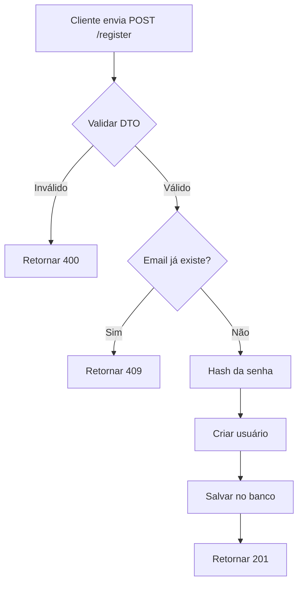

# 📝 POST /register - Registrar Novo Usuário

## 📋 Descrição

Endpoint para cadastrar um novo usuário no sistema. Valida os dados, verifica se o email já existe e cria o usuário com senha hasheada.

## 🔗 Endpoint

```
POST /api/register
```

## 🔓 Autenticação

**Não requer autenticação**

## 📥 Request

### Headers

```http
Content-Type: application/json
```

### Body

```json
{
  "email": "usuario@example.com",
  "password": "senha12345678"
}
```

### Campos

| Campo | Tipo | Obrigatório | Descrição | Validação |
|-------|------|-------------|-----------|-----------|
| email | string | ✅ | Email do usuário | Deve ser um email válido |
| password | string | ✅ | Senha do usuário | Mínimo 8 caracteres |

## 📤 Response

### Sucesso (201 Created)

```json
{
  "message": "Usuário cadastrado com sucesso"
}
```

ou

```json
{
  "id": "550e8400-e29b-41d4-a716-446655440000",
  "email": "usuario@example.com",
  "createdAt": "2026-02-01T10:30:00.000Z"
}
```

### Erro - Validação (400 Bad Request)

```json
{
  "statusCode": 400,
  "message": [
    "Email inválido",
    "A senha deve ter no mínimo 8 caracteres"
  ],
  "error": "Bad Request"
}
```

### Erro - Email já cadastrado (409 Conflict)

```json
{
  "statusCode": 409,
  "message": "Email já cadastrado",
  "error": "Conflict"
}
```

### Erro - Servidor (500 Internal Server Error)

```json
{
  "statusCode": 500,
  "message": "Erro ao cadastrar usuário",
  "error": "Internal Server Error"
}
```

## 💻 Implementação NestJS

### DTO (Data Transfer Object)

```typescript
// src/auth/dto/register.dto.ts
import { IsEmail, IsString, MinLength } from 'class-validator';
import { ApiProperty } from '@nestjs/swagger';

export class RegisterDto {
  @ApiProperty({
    example: 'usuario@example.com',
    description: 'Email do usuário'
  })
  @IsEmail({}, { message: 'Email inválido' })
  email: string;

  @ApiProperty({
    example: 'senha12345678',
    description: 'Senha do usuário',
    minLength: 8
  })
  @IsString()
  @MinLength(8, { message: 'A senha deve ter no mínimo 8 caracteres' })
  password: string;
}
```

### Controller

```typescript
// src/auth/auth.controller.ts
import { Controller, Post, Body, HttpCode, HttpStatus } from '@nestjs/common';
import { ApiTags, ApiOperation, ApiResponse } from '@nestjs/swagger';
import { AuthService } from './auth.service';
import { RegisterDto } from './dto/register.dto';

@ApiTags('Authentication')
@Controller('api')
export class AuthController {
  constructor(private readonly authService: AuthService) {}

  @Post('register')
  @HttpCode(HttpStatus.CREATED)
  @ApiOperation({ summary: 'Registrar novo usuário' })
  @ApiResponse({ status: 201, description: 'Usuário cadastrado com sucesso' })
  @ApiResponse({ status: 400, description: 'Dados inválidos' })
  @ApiResponse({ status: 409, description: 'Email já cadastrado' })
  async register(@Body() registerDto: RegisterDto) {
    return this.authService.register(registerDto);
  }
}
```

### Service

```typescript
// src/auth/auth.service.ts
import { Injectable, ConflictException } from '@nestjs/common';
import { InjectRepository } from '@nestjs/typeorm';
import { Repository } from 'typeorm';
import * as bcrypt from 'bcrypt';
import { User } from '../users/entities/user.entity';
import { RegisterDto } from './dto/register.dto';

@Injectable()
export class AuthService {
  constructor(
    @InjectRepository(User)
    private usersRepository: Repository<User>,
  ) {}

  async register(registerDto: RegisterDto) {
    const { email, password } = registerDto;

    // Verifica se o email já existe
    const existingUser = await this.usersRepository.findOne({
      where: { email }
    });

    if (existingUser) {
      throw new ConflictException('Email já cadastrado');
    }

    // Hash da senha
    const saltRounds = 10;
    const hashedPassword = await bcrypt.hash(password, saltRounds);

    // Cria o usuário
    const user = this.usersRepository.create({
      email,
      password: hashedPassword
    });

    // Salva no banco
    await this.usersRepository.save(user);

    return {
      message: 'Usuário cadastrado com sucesso'
    };
  }
}
```

### Entity

```typescript
// src/users/entities/user.entity.ts
import {
  Entity,
  Column,
  PrimaryGeneratedColumn,
  CreateDateColumn,
  UpdateDateColumn,
} from 'typeorm';

@Entity('users')
export class User {
  @PrimaryGeneratedColumn('uuid')
  id: string;

  @Column({ unique: true })
  email: string;

  @Column()
  password: string;

  @CreateDateColumn()
  createdAt: Date;

  @UpdateDateColumn()
  updatedAt: Date;
}
```

## 🧪 Exemplos de Teste

### cURL

```bash
curl -X POST http://localhost:3000/api/register \
  -H "Content-Type: application/json" \
  -d '{
    "email": "usuario@example.com",
    "password": "senha12345678"
  }'
```

### JavaScript (Fetch)

```javascript
const response = await fetch('http://localhost:3000/api/register', {
  method: 'POST',
  headers: {
    'Content-Type': 'application/json'
  },
  body: JSON.stringify({
    email: 'usuario@example.com',
    password: 'senha12345678'
  })
});

const data = await response.json();
console.log(data);
```

### Postman

1. **Method:** POST
2. **URL:** `http://localhost:3000/api/register`
3. **Headers:**
   - `Content-Type: application/json`
4. **Body (raw JSON):**
```json
{
  "email": "usuario@example.com",
  "password": "senha12345678"
}
```

## ✅ Validações Necessárias

### Backend
- [x] Email deve ser válido (formato correto)
- [x] Senha deve ter no mínimo 8 caracteres
- [x] Email deve ser único no banco de dados
- [x] Senha deve ser hasheada antes de salvar
- [x] Retornar erro apropriado se email já existir

### Frontend (já implementado)
- ✅ Validação de email com Zod
- ✅ Validação de senha mínima de 8 caracteres
- ✅ Confirmação de senha
- ✅ Feedback visual de erros
- ✅ Redirecionamento para login após sucesso

## 🔒 Segurança

1. **Hash de Senha:** Use bcrypt com salt rounds = 10
2. **Email Único:** Constraint UNIQUE no banco de dados
3. **Validação de Input:** Use class-validator no DTO
4. **Rate Limiting:** Limite de requisições por IP (recomendado)
5. **HTTPS:** Use sempre HTTPS em produção

## 📊 Status Codes

| Status | Descrição |
|--------|-----------|
| 201 | Created - Usuário cadastrado com sucesso |
| 400 | Bad Request - Dados inválidos |
| 409 | Conflict - Email já cadastrado |
| 500 | Internal Server Error - Erro no servidor |

## 🔄 Fluxo de Execução



## 🐛 Troubleshooting

### Erro: "Email já cadastrado" mas não consigo fazer login

**Causa:** O usuário foi cadastrado mas pode haver problema no hash da senha ou no login.

**Solução:** Verifique o endpoint de login e se o bcrypt está comparando corretamente.

### Erro: Validação não está funcionando

**Causa:** ValidationPipe não está configurado globalmente.

**Solução:** Configure no `main.ts`:

```typescript
import { ValidationPipe } from '@nestjs/common';

async function bootstrap() {
  const app = await NestFactory.create(AppModule);
  app.useGlobalPipes(new ValidationPipe());
  await app.listen(3000);
}
```

### Erro: CORS bloqueando requisições

**Causa:** CORS não está configurado para aceitar requisições do front-end.

**Solução:** Configure CORS no `main.ts`:

```typescript
app.enableCors({
  origin: 'http://localhost:4200',
  credentials: true
});
```

---

**Próximo:** [Login API →](./login_API.md)
